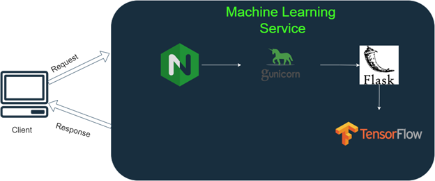

# Object Detection with Tensorflow and Deployment on AWS using Docker, Flask
## 1. Problem Overview
Throughout this project, we address the challenges of object detection performance, deployment, and accessibility. By combining lightweight object detection models, containerization with Docker, and deployment on AWS, we provide an end-to-end solution that facilitates efficient object detection at scale. The project report covers the methodology, implementation details, and performance analysis, showcasing the benefits and potential applications of the developed system.

## 2. Methodology and Approach
### 2.1. Implementation of data processing and application
We initially utilized a CNN model implemented in Tensorflow documentation. The original documentation utilizes FasterRCNN+InceptionResNet V2 for the detection. The size of this model is larger than 200 MB so it takes a bit long to load the model. So, we utilized a more lightweight model ssd+mobilenet. I downloaded this model on the local and loaded the model before the flask app started.

### 2.3. Local and remote execution
- Local execution
We can run the flask app on a local machine using the “python3 app.py” command. Or we can use "gunicorn app:app --bind 0.0.0.0:8000".

In order to run the docker image on the local machine, we can use the “docker run -p 8000:8000 dic-assignment” command to run the docker image.

- Execution on EC2
First, we created an EC2 instance on AWS. We named the instance object_detection_docker_EC2. We created a t2.large instance with 2 CPUs and 24 GB of additional storage.

We utilized git to upload the code on EC2. Here, we installed the docker on EC2 instance and built the docker image over there. The process is the same as the local. After the docker image is ready, we run the app with “docker run -p 8000:8000 dic-assignment” command. Once the docker image is running, we can see the following commands from the EC2.

In order to deploy the application on the AWS EC2, we should reverse the proxy using nginx. We can run the web browser and type the ip address and port of this EC2 instance to open this app. The command is http://<ip_address>:8000/. For example, http://3.91.148.139:8000/.



## Build docker image from Dockerfile
```bash
docker build -t dic-assignment .
```

## Run docker container locally
```bash
docker run -d -p 5000:5000 dic-assignment
```

## Run the flask app
```bash
python3 app.py
```

Open the web browser and type localhost:8000

